# I2C Module Call Graph

```mermaid
flowchart TB
    subgraph APP["app_main.c"]
        direction TB
        app_main["app_main()<br/>────────<br/>Main super loop<br/>Polls button and runs modules"]
    end
    
    subgraph I2C["i2c.c - Public API"]
        direction TB
        get_cfg["i2c_get_def_cfg()<br/>────────<br/>Get default config (100ms timeout)"]
        init["i2c_init()<br/>────────<br/>Initialize I2C instance<br/>Store config and hardware base"]
        start["i2c_start()<br/>────────<br/>Enable NVIC interrupts<br/>Get guard timer"]
        run["i2c_run()<br/>────────<br/>Run function (no-op for I2C)"]
        
        reserve["i2c_reserve()<br/>────────<br/>🔒 Reserve bus (mutual exclusion)"]
        release["i2c_release()<br/>────────<br/>🔓 Release bus for others"]
        
        write["i2c_write()<br/>────────<br/>Start write operation (non-blocking)"]
        read["i2c_read()<br/>────────<br/>Start read operation (non-blocking)"]
        
        get_status["i2c_get_op_status()<br/>────────<br/>Poll: in progress / done / error"]
        get_error["i2c_get_error()<br/>────────<br/>Get detailed error code"]
        bus_busy["i2c_bus_busy()<br/>────────<br/>Check hardware BUSY flag"]
        
        auto_test["i2c_run_auto_test()<br/>────────<br/>⚡ Automated button test<br/>6-state: reserve→write→read→release"]
    end
    
    subgraph HELPERS["i2c.c - Private Helpers"]
        direction TB
        start_op["start_op()<br/>────────<br/>Common logic for write/read<br/>Enable I2C, generate START, enable IRQs"]
        
        op_success["op_stop_success()<br/>────────<br/>✅ Clean up after success<br/>Disable IRQs, stop timer, go IDLE"]
        
        op_fail["op_stop_fail()<br/>────────<br/>❌ Clean up after failure<br/>Record error, go IDLE"]
        
        tmr_cb["tmr_callback()<br/>────────<br/>⏱️ Guard timer timeout (100ms)<br/>Abort operation"]
    end
    
    subgraph ISR["i2c.c - Interrupt Handlers"]
        direction TB
        ev_isr["I2C3_EV_IRQHandler()<br/>────────<br/>⚡ Event interrupt (SB, ADDR, TXE, RXNE)"]
        
        er_isr["I2C3_ER_IRQHandler()<br/>────────<br/>⚡ Error interrupt (AF, BERR, etc)"]
        
        interrupt["i2c_interrupt()<br/>────────<br/>🔧 7-state machine<br/>Process one step per interrupt"]
    end
    
    subgraph TEST["i2c.c - Console Test"]
        direction TB
        cmd_test["cmd_i2c_test()<br/>────────<br/>Console: i2c test<br/>reserve/release/write/read/status/msg"]
    end
    
    %% App main calls
    app_main ==>|"button pressed"| auto_test
    
    %% Initialization chain
    app_main --> get_cfg
    app_main --> init
    app_main --> start
    
    %% Auto test chain
    auto_test --> reserve
    auto_test --> write
    auto_test --> read
    auto_test --> get_status
    auto_test --> release
    
    %% Console test chain
    cmd_test --> reserve
    cmd_test --> release
    cmd_test --> write
    cmd_test --> read
    cmd_test --> get_status
    cmd_test --> get_error
    cmd_test --> bus_busy
    
    %% Write/Read call start_op
    write --> start_op
    read --> start_op
    
    %% Interrupt handlers
    ev_isr ==>|"EVENT"| interrupt
    er_isr ==>|"ERROR"| interrupt
    
    %% Interrupt processing
    interrupt -->|"success"| op_success
    interrupt -->|"error"| op_fail
    
    %% Timer callback
    tmr_cb -->|"timeout"| op_fail
    
    %% Hardware triggers (shown as external)
    HW_EVENT["🔧 Hardware Events<br/>────────<br/>SB, ADDR, TXE, RXNE, BTF"] -.->|"triggers"| ev_isr
    HW_ERROR["⚠️ Hardware Errors<br/>────────<br/>AF, BERR, ARLO"] -.->|"triggers"| er_isr
    TMR_MOD["⏱️ Timer Module<br/>────────<br/>Fires after 100ms"] -.->|"timeout"| tmr_cb
    
    %% Styling by call chain
    
    %% Chain 1: Initialization (Red)
    classDef chain1 fill:#cc3333,stroke:#ff6666,stroke-width:2px,color:#fff
    class app_main,get_cfg,init,start,run chain1
    
    %% Chain 2: Normal operation - Reserve/Release/Status (Blue)
    classDef chain2 fill:#3366cc,stroke:#6699ff,stroke-width:2px,color:#fff
    class reserve,release,write,read,get_status,get_error,bus_busy,start_op chain2
    
    %% Chain 3: Interrupt handling (Green - state machine)
    classDef chain3 fill:#339933,stroke:#66cc66,stroke-width:2px,color:#fff
    class ev_isr,er_isr,interrupt,op_success,op_fail chain3
    
    %% Chain 4: Test/Debug (Orange)
    classDef chain4 fill:#cc6600,stroke:#ff9933,stroke-width:2px,color:#fff
    class auto_test,cmd_test chain4
    
    %% Chain 5: External triggers (Gray)
    classDef chain5 fill:#666666,stroke:#999999,stroke-width:2px,color:#fff
    class HW_EVENT,HW_ERROR,TMR_MOD,tmr_cb chain5
    
    %% Green links for success path: HW_EVENT -> ev_isr -> interrupt -> op_success
    linkStyle 23 stroke:#66cc66,stroke-width:3px
    linkStyle 18 stroke:#66cc66,stroke-width:3px
    linkStyle 20 stroke:#66cc66,stroke-width:3px
```

## Call Chain Summary

### 🔴 Chain 1: Initialization (Red)
- `app_main()` → `i2c_get_def_cfg()` → `i2c_init()` → `i2c_start()`
- Called once at startup to configure I2C peripheral

### 🔵 Chain 2: Normal Operation (Blue)
- Application calls: `i2c_reserve()` → `i2c_write()`/`i2c_read()` → `i2c_get_op_status()` → `i2c_release()`
- `i2c_write()`/`i2c_read()` both call `start_op()` to begin transaction
- Non-blocking: operations return immediately, poll status later

### 🟢 Chain 3: Interrupt-Driven State Machine (Green)
- Hardware triggers → `I2C3_EV_IRQHandler()` or `I2C3_ER_IRQHandler()`
- Both ISRs call → `i2c_interrupt()` (processes one state transition)
- `i2c_interrupt()` calls → `op_stop_success()` or `op_stop_fail()` when done
- Guard timer → `tmr_callback()` → `op_stop_fail()` on timeout

### 🟠 Chain 4: Test/Debug (Orange)
- Button press → `app_main()` → `i2c_run_auto_test()` (automated 6-state test)
- Console → `cmd_i2c_test()` (manual testing via commands)
- Both use the normal operation chain (reserve/write/read/status/release)

### ⚪ Chain 5: External Triggers (Gray)
- Hardware events (SB, ADDR, TXE, RXNE) trigger event ISR
- Hardware errors (AF, BERR) trigger error ISR
- Timer module fires guard timer callback after 100ms

## Key Observations

1. **Non-blocking Design**: `write()`/`read()` return immediately; application polls `get_op_status()`

2. **Interrupt-Driven**: State machine advances in `i2c_interrupt()`, called by hardware ISRs

3. **Mutual Exclusion**: `reserve()`/`release()` provide simple bus sharing without OS semaphores

4. **Timeout Protection**: Guard timer prevents infinite hangs if slave doesn't respond

5. **Two Test Modes**: 
   - Automated: Button-triggered `i2c_run_auto_test()` (6-state machine)
   - Manual: Console commands via `cmd_i2c_test()`

---

## i2c_run_auto_test() Success Path - Detailed Flow

This diagram shows the complete success path through the automated test, including the interaction between the super loop, state machine, and interrupt handlers.

```mermaid
flowchart TB
    subgraph MAIN["app_main.c - Super Loop"]
        direction TB
        loop_start["while(1) Loop<br/>────────<br/>Button polling + module run"]
        button_check{"Button<br/>pressed?"}
        call_test["i2c_run_auto_test()<br/>────────<br/>Call state machine"]
        check_done{"Return<br/>value?"}
        continue_loop["Continue loop<br/>────────<br/>Call test again next iteration"]
        test_done["✅ Test Complete<br/>────────<br/>Stop calling until next button press"]
    end
    
    subgraph AUTO_TEST["i2c.c - i2c_run_auto_test() State Machine"]
        direction TB
        
        STATE0["STATE 0: Reserve<br/>────────<br/>i2c_reserve()"]
        
        STATE1["STATE 1: Write<br/>────────<br/>msg = {0x2c, 0x06}<br/>i2c_write(0x44, msg, 2)"]
        
        STATE2["STATE 2: Poll Write<br/>────────<br/>i2c_get_op_status()"]
        STATE2_CHK{"Status"}
        STATE2_WAIT["⏳ IN_PROG<br/>────────<br/>Return 0<br/>Wait next loop"]
        
        STATE3["STATE 3: Read<br/>────────<br/>i2c_read(0x44, buf, 6)"]
        
        STATE4["STATE 4: Poll Read<br/>────────<br/>i2c_get_op_status()"]
        STATE4_CHK{"Status"}
        STATE4_WAIT["⏳ IN_PROG<br/>────────<br/>Return 0<br/>Wait next loop"]
        
        STATE5["STATE 5: Release<br/>────────<br/>i2c_release()<br/>Return 1 (DONE)"]
    end
    
    subgraph API["i2c.c - Public API Functions"]
        direction TB
        reserve_fn["i2c_reserve()<br/>────────<br/>Set reserved=true"]
        
        write_fn["i2c_write()<br/>────────<br/>Call start_op()<br/>with WR_GEN_START"]
        
        read_fn["i2c_read()<br/>────────<br/>Call start_op()<br/>with RD_GEN_START"]
        
        status_fn["i2c_get_op_status()<br/>────────<br/>Check state:<br/>IDLE=done, else IN_PROG"]
        
        release_fn["i2c_release()<br/>────────<br/>Set reserved=false"]
    end
    
    subgraph HELPERS["i2c.c - Helper Functions"]
        direction TB
        start_op_fn["start_op()<br/>────────<br/>1. Start guard timer<br/>2. Save params (addr, buf, len)<br/>3. Set state (WR/RD)<br/>4. Enable I2C peripheral<br/>5. Generate START<br/>6. Enable interrupts"]
        
        op_success_fn["op_stop_success()<br/>────────<br/>1. Disable interrupts<br/>2. Generate STOP<br/>3. Stop guard timer<br/>4. Set state=IDLE<br/>5. Set error=NONE"]
    end
    
    subgraph ISR_WRITE["i2c.c - Write Interrupt Flow"]
        direction TB
        hw_wr_start["🔧 HW: START sent<br/>────────<br/>SB flag set"]
        isr_wr_1["I2C3_EV_IRQHandler<br/>────────<br/>Call i2c_interrupt()"]
        
        hw_wr_addr["🔧 HW: Address ACKed<br/>────────<br/>ADDR flag set"]
        isr_wr_2["I2C3_EV_IRQHandler<br/>────────<br/>Call i2c_interrupt()"]
        
        hw_wr_data["🔧 HW: Data sent<br/>────────<br/>TXE/BTF flags"]
        isr_wr_3["I2C3_EV_IRQHandler<br/>────────<br/>Call i2c_interrupt()"]
        
        sm_wr["i2c_interrupt()<br/>────────<br/>WR_GEN_START<br/>→ WR_SENDING_ADDR<br/>→ WR_SENDING_DATA<br/>→ IDLE"]
    end
    
    subgraph ISR_READ["i2c.c - Read Interrupt Flow"]
        direction TB
        hw_rd_start["🔧 HW: START sent<br/>────────<br/>SB flag set"]
        isr_rd_1["I2C3_EV_IRQHandler<br/>────────<br/>Call i2c_interrupt()"]
        
        hw_rd_addr["🔧 HW: Address ACKed<br/>────────<br/>ADDR flag set"]
        isr_rd_2["I2C3_EV_IRQHandler<br/>────────<br/>Call i2c_interrupt()"]
        
        hw_rd_data["🔧 HW: Data received<br/>────────<br/>RXNE flags"]
        isr_rd_3["I2C3_EV_IRQHandler<br/>────────<br/>Call i2c_interrupt()"]
        
        sm_rd["i2c_interrupt()<br/>────────<br/>RD_GEN_START<br/>→ RD_SENDING_ADDR<br/>→ RD_READING_DATA<br/>→ IDLE"]
    end
    
    %% Super loop flow
    loop_start --> button_check
    button_check -->|"Yes"| call_test
    button_check -->|"No"| loop_start
    call_test --> check_done
    check_done -->|"0 (in progress)"| continue_loop
    check_done -->|"1 (done)"| test_done
    continue_loop -.->|"Next iteration"| loop_start
    test_done --> loop_start
    
    %% State machine flow - success path only
    call_test --> STATE0
    STATE0 --> STATE1
    STATE1 --> STATE2
    STATE2 --> STATE2_CHK
    STATE2_CHK -->|"IN_PROG"| STATE2_WAIT
    STATE2_CHK -->|"0 (done)"| STATE3
    STATE2_WAIT -.->|"Return to app_main"| continue_loop
    
    STATE3 --> STATE4
    STATE4 --> STATE4_CHK
    STATE4_CHK -->|"IN_PROG"| STATE4_WAIT
    STATE4_CHK -->|"0 (done)"| STATE5
    STATE4_WAIT -.->|"Return to app_main"| continue_loop
    
    STATE5 -.->|"Return 1"| check_done
    
    %% API calls from state machine
    STATE0 --> reserve_fn
    STATE1 --> write_fn
    STATE2 --> status_fn
    STATE3 --> read_fn
    STATE4 --> status_fn
    STATE5 --> release_fn
    
    %% API to helpers
    write_fn --> start_op_fn
    read_fn --> start_op_fn
    
    %% Write interrupt chain
    start_op_fn -.->|"Triggers HW"| hw_wr_start
    hw_wr_start ==> isr_wr_1
    isr_wr_1 ==> sm_wr
    sm_wr -.->|"Sends addr"| hw_wr_addr
    hw_wr_addr ==> isr_wr_2
    isr_wr_2 ==> sm_wr
    sm_wr -.->|"Sends data"| hw_wr_data
    hw_wr_data ==> isr_wr_3
    isr_wr_3 ==> sm_wr
    sm_wr ==> op_success_fn
    op_success_fn -.->|"Sets state=IDLE"| status_fn
    
    %% Read interrupt chain
    start_op_fn -.->|"Triggers HW"| hw_rd_start
    hw_rd_start ==> isr_rd_1
    isr_rd_1 ==> sm_rd
    sm_rd -.->|"Sends addr+R"| hw_rd_addr
    hw_rd_addr ==> isr_rd_2
    isr_rd_2 ==> sm_rd
    sm_rd -.->|"Receives data"| hw_rd_data
    hw_rd_data ==> isr_rd_3
    isr_rd_3 ==> sm_rd
    sm_rd ==> op_success_fn
    
    %% Styling
    classDef mainLoop fill:#cc3333,stroke:#ff6666,stroke-width:2px,color:#fff
    classDef stateBox fill:#3366cc,stroke:#6699ff,stroke-width:2px,color:#fff
    classDef apiBox fill:#0066cc,stroke:#3399ff,stroke-width:2px,color:#fff
    classDef helperBox fill:#006699,stroke:#0099cc,stroke-width:2px,color:#fff
    classDef isrBox fill:#339933,stroke:#66cc66,stroke-width:2px,color:#fff
    classDef hwBox fill:#666666,stroke:#999999,stroke-width:2px,color:#fff
    classDef checkBox fill:#cc9900,stroke:#ffcc00,stroke-width:2px,color:#fff
    classDef waitBox fill:#666699,stroke:#9999cc,stroke-width:2px,color:#fff
    
    class loop_start,button_check,call_test,check_done,continue_loop,test_done mainLoop
    class STATE0,STATE1,STATE2,STATE3,STATE4,STATE5 stateBox
    class reserve_fn,write_fn,read_fn,status_fn,release_fn apiBox
    class start_op_fn,op_success_fn helperBox
    class isr_wr_1,isr_wr_2,isr_wr_3,sm_wr,isr_rd_1,isr_rd_2,isr_rd_3,sm_rd isrBox
    class hw_wr_start,hw_wr_addr,hw_wr_data,hw_rd_start,hw_rd_addr,hw_rd_data hwBox
    class STATE2_CHK,STATE4_CHK checkBox
    class STATE2_WAIT,STATE4_WAIT waitBox
    
    %% Highlight key call paths from i2c_run_auto_test
    %% Reserve path (orange)
    linkStyle 21 stroke:#ff9933,stroke-width:3px
    
    %% Write path: STATE1 -> write_fn -> start_op -> HW (blue)
    linkStyle 22 stroke:#3399ff,stroke-width:3px
    linkStyle 27 stroke:#3399ff,stroke-width:3px
    linkStyle 29 stroke:#3399ff,stroke-width:3px
    
    %% Read path: STATE3 -> read_fn -> start_op -> HW (purple)
    linkStyle 24 stroke:#cc66ff,stroke-width:3px
    linkStyle 28 stroke:#cc66ff,stroke-width:3px
    linkStyle 40 stroke:#cc66ff,stroke-width:3px
```

## Success Path Walkthrough

### 🔴 Super Loop (Red) - app_main.c
The main loop continuously polls the button and calls the test function:

1. `while(1)` loop checks button state
2. If button pressed: call `i2c_run_auto_test()`
3. Check return value:
   - `0` = Continue calling next iteration
   - `1` = Test done, stop calling

### 🔵 State Machine (Blue) - i2c_run_auto_test()
6-state machine that persists across function calls using `static` variables:

**STATE 0**: Reserve bus → **STATE 1**  
**STATE 1**: Start write (non-blocking) → **STATE 2**  
**STATE 2**: Poll status → If done: **STATE 3**, If in progress: return `0` to app_main  
**STATE 3**: Start read (non-blocking) → **STATE 4**  
**STATE 4**: Poll status → If done: **STATE 5**, If in progress: return `0` to app_main  
**STATE 5**: Release bus → return `1` to app_main ✅

### 🟦 API Functions (Dark Blue)
Public functions called by state machine:
- `i2c_reserve()` - Set bus reserved flag
- `i2c_write()` / `i2c_read()` - Start operations (call `start_op()`)
- `i2c_get_op_status()` - Poll for completion
- `i2c_release()` - Clear reserved flag

### 🟦 Helper Functions (Darker Blue)
Internal functions that do the real work:
- `start_op()` - Common setup for write/read (enable peripheral, start timer, trigger hardware)
- `op_stop_success()` - Cleanup after successful completion (disable interrupts, stop timer, set IDLE)

### 🟢 Interrupt Handlers (Green)
Hardware-driven state machine advancement:

**Write Path:**
1. Hardware sends START → `SB` flag → ISR called
2. `i2c_interrupt()` sends address → Hardware ACKs → `ADDR` flag → ISR called
3. `i2c_interrupt()` sends data → Hardware completes → `BTF` flag → ISR called
4. `i2c_interrupt()` calls `op_stop_success()` → state becomes `IDLE`

**Read Path:**
1. Hardware sends START → `SB` flag → ISR called
2. `i2c_interrupt()` sends address+R bit → Hardware ACKs → `ADDR` flag → ISR called
3. `i2c_interrupt()` receives data → `RXNE` flags → ISR called multiple times
4. `i2c_interrupt()` calls `op_stop_success()` → state becomes `IDLE`

### ⚪ Hardware Events (Gray)
STM32 I2C peripheral generates events:
- `SB` - START condition sent
- `ADDR` - Address sent and ACKed by slave
- `TXE/BTF` - Data transmitted
- `RXNE` - Data received

## Key Observations

### 💡 Non-Blocking Polling Pattern
1. **STATE 1** calls `i2c_write()` which starts the operation and returns immediately
2. **STATE 2** polls `i2c_get_op_status()` repeatedly:
   - Returns `MOD_ERR_OP_IN_PROG` while interrupt handler is working
   - Returns `0` when state machine reaches `IDLE` (success)
3. While in STATE 2, the function returns `0` to `app_main()`
4. `app_main()` continues running other modules, then calls test function again
5. Eventually state machine completes, status returns `0`, advances to STATE 3

**This is cooperative multitasking!** No blocking delays, CPU stays busy with other work.

### 🔄 Dual State Machines
1. **High-level**: `i2c_run_auto_test()` 6-state machine (reserves, writes, reads, releases)
2. **Low-level**: `i2c_interrupt()` 7-state machine (handles I2C protocol details)

They communicate through:
- State machine status (IDLE vs active states)
- Return codes from API functions
- Polling `i2c_get_op_status()`

### ⏱️ Timing Characteristics
- **Reserve/Release**: Immediate (just sets flag)
- **Write/Read start**: ~microseconds (starts hardware, enables interrupts)
- **Write/Read completion**: ~milliseconds (depends on I2C clock speed and data length)
- **Polling overhead**: Minimal (just checks state variable)

