# Most Basic Fault Module Code Reference

## Overview

The fault module provides **panic mode operation** for embedded systems - capturing diagnostic data when the system crashes and performing safe recovery via reset. It integrates with the watchdog module to handle timeout faults and ARM exception handlers for hardware faults.

**Key Concept:** When a fault occurs, the system enters a minimal "panic mode" that:
1. Disables interrupts (no more corruption)
2. Resets stack pointer (ensure stack is safe)
3. Collects diagnostic data (ARM registers, flight recorder)
4. Writes to flash (data survives reset!)
5. Resets the MCU (recovery)

---

## Core Data Structures

```c
// Fault types
enum fault_type {
    FAULT_TYPE_WDG = 1,       // Watchdog timeout
    FAULT_TYPE_EXCEPTION,     // ARM exception (hard fault, etc.)
};

// Diagnostic data structure - written to flash, survives reset
struct fault_data {
    uint32_t magic;                  // MOD_MAGIC_FAULT - identifies valid data
    uint32_t num_section_bytes;      // Size of this structure
    
    uint32_t fault_type;             // FAULT_TYPE_WDG or FAULT_TYPE_EXCEPTION
    uint32_t fault_param;            // Watchdog ID or exception number
    
    // ARM exception stack frame (8 registers pushed by hardware)
    uint32_t excpt_stk_r0;           // R0 at time of exception
    uint32_t excpt_stk_r1;           // R1
    uint32_t excpt_stk_r2;           // R2
    uint32_t excpt_stk_r3;           // R3
    uint32_t excpt_stk_r12;          // R12
    uint32_t excpt_stk_lr;           // LR (return address from exception)
    uint32_t excpt_stk_rtn_addr;     // PC (where exception occurred)
    uint32_t excpt_stk_xpsr;         // Program status register
    
    // Additional diagnostic registers
    uint32_t sp;                     // Stack pointer when fault detected
    uint32_t lr;                     // Link register (function that called fault)
    uint32_t ipsr;                   // Exception number
    uint32_t icsr;                   // Interrupt control state
    uint32_t shcsr;                  // System handler control state
    uint32_t cfsr;                   // Configurable fault status (WHY fault occurred)
    uint32_t hfsr;                   // Hard fault status
    uint32_t mmfar;                  // Memory management fault address
    uint32_t bfar;                   // Bus fault address
    uint32_t tick_ms;                // Time of fault (milliseconds since boot)
};

// Static buffer for fault data collection
static struct fault_data fault_data_buf;

// Reset reason - captured at boot
static uint32_t rcc_csr;           // RCC Control/Status Register
static bool got_rcc_csr = false;

// Linker script symbols for stack boundaries
extern uint32_t _sdata;            // Start of RAM data section
extern uint32_t _estack;           // Top of stack (highest address)
extern uint32_t _s_stack_guard;    // Start of stack guard region
extern uint32_t _e_stack_guard;    // End of stack guard region
```

---

## Essential Pattern Implementation

### 1. Initialization Sequence

```c
#define STACK_INIT_PATTERN 0xcafebadd  // Recognizable pattern for high water mark

int32_t fault_init(struct fault_cfg* cfg)
{
    /* Critical: Capture reset reason NOW before it's cleared by hardware.
     * RCC_CSR register tells us WHY the system last reset:
     * - IWDGRSTF: Independent watchdog reset
     * - WWDGRSTF: Window watchdog reset
     * - SFTRSTF: Software reset
     * - PORRSTF: Power-on reset
     * - etc.
     */
    fault_get_rcc_csr();
    
    return 0;
}

int32_t fault_start(void)
{
    int32_t rc;
    uint32_t* sp;
    
    // Register console commands (for debugging)
    rc = cmd_register(&cmd_info);
    if (rc < 0)
        return rc;
    
    /* Register callback with watchdog module.
     * When ANY watchdog times out, watchdog module calls our handler.
     */
    rc = wdg_register_triggered_cb(wdg_triggered_handler);
    if (rc != 0)
        return rc;
    
    /* Fill unused stack with pattern for high water mark detection.
     * This lets us measure maximum stack usage before a fault.
     * Start from current SP and fill downward to stack guard.
     */
    __ASM volatile("MOV  %0, sp" : "=r" (sp) : : "memory");
    sp--;  // Move to first unused word
    while (sp >= &_s_stack_guard)
        *sp-- = STACK_INIT_PATTERN;
    
    /* Optional: Configure MPU stack guard (prevents stack overflow into RAM).
     * Sets up a 32-byte read-only region that triggers exception on write.
     * If stack grows too large and hits this region → MemManage fault.
     */
    LL_MPU_ConfigRegion(0, 0, (uint32_t)(&_s_stack_guard),
                        LL_MPU_REGION_SIZE_32B |
                        LL_MPU_REGION_PRIV_RO_URO |
                        LL_MPU_TEX_LEVEL0 |
                        LL_MPU_INSTRUCTION_ACCESS_DISABLE |
                        LL_MPU_ACCESS_SHAREABLE |
                        LL_MPU_ACCESS_NOT_CACHEABLE |
                        LL_MPU_ACCESS_NOT_BUFFERABLE);
    
    ARM_MPU_Enable(MPU_CTRL_PRIVDEFENA_Msk | MPU_CTRL_HFNMIENA_Msk);
    
    return 0;
}
```

---

### 2. Panic Mode Entry Points

#### Software-Detected Fault (Called by Code)

```c
void fault_detected(enum fault_type fault_type, uint32_t fault_param)
{
    /* CRITICAL: System is in unknown state - must be EXTREMELY careful!
     * Disable interrupts immediately to prevent further corruption.
     */
    CRIT_START();  // Disable interrupts - no more changes to system state
    
    /* Feed hardware watchdog to buy time for diagnostic collection.
     * Without this, hardware watchdog would reset mid-collection.
     * Typical panic operations take 100-1000ms (flash erase/write).
     */
    wdg_feed_hdw();
    
    /* Disable MPU to avoid triggering secondary faults during panic.
     * We might access unusual memory regions during diagnostic collection.
     */
    ARM_MPU_Disable();
    
    /* Start collecting fault information.
     * Fill in what we know: fault type and parameter.
     * Clear exception stack (not valid for software-detected faults).
     */
    fault_data_buf.fault_type = fault_type;
    fault_data_buf.fault_param = fault_param;
    memset(&fault_data_buf.excpt_stk_r0, 0, EXCPT_STK_BYTES);
    
    /* Save current LR and SP BEFORE moving SP!
     * LR tells us who called fault_detected() (useful for debugging).
     * SP tells us where stack was when fault occurred.
     */
    __ASM volatile("MOV  %0, lr" : "=r" (fault_data_buf.lr) : : "memory");
    __ASM volatile("MOV  %0, sp" : "=r" (fault_data_buf.sp) : : "memory");
    
    /* Reset stack pointer to top of RAM.
     * Old stack may be corrupted/overflowed - can't trust it.
     * Moving to _estack gives us fresh, known-good stack for panic operations.
     */
    __ASM volatile("MOV  sp, %0" : : "r" (_estack) : "memory");
    
    /* Call common handler to finish collection and reset.
     * This function never returns - ends with NVIC_SystemReset().
     */
    fault_common_handler();
}
```

#### Hardware Exception Fault (Called by ARM Exception Handler)

```c
void fault_exception_handler(uint32_t sp)
{
    /* This is called from assembly exception handler:
     *     Default_Handler:
     *         mov  r0, sp      ; Pass original SP to C code
     *         b    fault_exception_handler
     */
    
    // Same panic mode setup
    CRIT_START();
    wdg_feed_hdw();
    ARM_MPU_Disable();
    
    // Collect basic fault info
    fault_data_buf.fault_type = FAULT_TYPE_EXCEPTION;
    fault_data_buf.fault_param = __get_IPSR();  // Exception number
    __ASM volatile("MOV  %0, lr" : "=r" (fault_data_buf.lr) : : "memory");
    fault_data_buf.sp = sp;  // SP from parameter (before handler reset it)
    
    /* Try to copy exception stack frame if SP looks valid.
     * ARM hardware pushes 8 registers (R0-R3, R12, LR, PC, xPSR) on exception.
     * Only copy if SP is:
     * - Aligned to 8 bytes
     * - Within RAM boundaries
     * - Has room for full frame
     */
    if (((sp & 0x7) == 0) &&
        (sp >= (uint32_t)&_sdata) &&
        ((sp + EXCPT_STK_BYTES + 4) <= (uint32_t)&_estack)) {
        memcpy(&fault_data_buf.excpt_stk_r0, (uint8_t*)sp, EXCPT_STK_BYTES);
    } else {
        memset(&fault_data_buf.excpt_stk_r0, 0, EXCPT_STK_BYTES);
    }
    
    fault_common_handler();
}
```

---

### 3. Common Panic Handler (The Heart)

```c
static void fault_common_handler(void)
{
    uint8_t* lwl_data;
    uint32_t lwl_num_bytes;
    
    /* Disable lightweight logging - we're panicking, don't create more logs.
     * Preserves existing LWL buffer contents for diagnostic collection.
     */
    lwl_enable(false);
    
    /* Print basic fault info to console (if available).
     * Uses printc_panic() which polls UART (no interrupts).
     */
    printc_panic("\nFault type=%lu param=%lu\n", 
                 fault_data_buf.fault_type,
                 fault_data_buf.fault_param);
    
    /* Set magic number and size for flash data structure.
     * Magic number lets recovery code identify valid fault data.
     */
    fault_data_buf.magic = MOD_MAGIC_FAULT;
    fault_data_buf.num_section_bytes = sizeof(fault_data_buf);
    
    /* Collect ARM system registers - these tell us WHY the fault occurred.
     * - IPSR: Exception number (which handler we're in)
     * - CFSR: Configurable Fault Status - specific fault reason
     * - HFSR: Hard Fault Status - escalated faults
     * - MMFAR/BFAR: Memory address that caused fault
     */
    fault_data_buf.ipsr = __get_IPSR();
    fault_data_buf.icsr = SCB->ICSR;
    fault_data_buf.shcsr = SCB->SHCSR;
    fault_data_buf.cfsr = SCB->CFSR;      // Most important for debugging!
    fault_data_buf.hfsr = SCB->HFSR;
    fault_data_buf.mmfar = SCB->MMFAR;
    fault_data_buf.bfar = SCB->BFAR;
    fault_data_buf.tick_ms = tmr_get_ms();
    
    /* Get LWL flight recorder buffer.
     * Contains recent log events leading up to fault - critical for debugging!
     */
    lwl_data = lwl_get_buffer(&lwl_num_bytes);
    
    /* Write all diagnostic data to flash (if enabled).
     * Flash survives reset - this is the ONLY way to debug field failures!
     * Layout in flash:
     *   [fault_data_buf] [lwl_buffer] [end_marker]
     */
    record_fault_data(0, (uint8_t*)&fault_data_buf, sizeof(fault_data_buf));
    record_fault_data(sizeof(fault_data_buf), lwl_data, lwl_num_bytes);
    
    // Write end marker (for multi-section parsing)
    struct end_marker end;
    memset(&end, 0, sizeof(end));
    end.magic = MOD_MAGIC_END;
    end.num_section_bytes = sizeof(end);
    record_fault_data(sizeof(fault_data_buf) + lwl_num_bytes, 
                      (uint8_t*)&end, sizeof(end));
    
    /* Reset the system - recovery via clean boot.
     * This function NEVER RETURNS!
     */
    NVIC_SystemReset();
}
```

---

### 4. Flash Recording (Polling Mode)

```c
#define FLASH_PANIC_DATA_ADDR ((uint8_t*)(CONFIG_FLASH_BASE_ADDR + \
                                          CONFIG_FLASH_SIZE - \
                                          CONFIG_FLASH_PAGE_SIZE))

static void record_fault_data(uint32_t data_offset, uint8_t* data_addr,
                              uint32_t num_bytes)
{
#if CONFIG_FAULT_PANIC_TO_FLASH
    static bool do_flash;
    int32_t rc;
    
    /* On first call (offset 0), check if flash already has fault data.
     * If magic matches, don't overwrite (preserve previous fault).
     */
    if (data_offset == 0) {
        do_flash = ((struct fault_data*)FLASH_PANIC_DATA_ADDR)->magic !=
                   MOD_MAGIC_FAULT;
    }
    
    if (do_flash) {
        // Erase flash page once at start
        if (data_offset == 0) {
            rc = flash_panic_erase_page((uint32_t*)FLASH_PANIC_DATA_ADDR);
            if (rc != 0)
                printc_panic("flash_panic_erase_page returns %ld\n", rc);
        }
        
        /* Write this chunk to flash.
         * flash_panic_write() uses polling mode (no interrupts).
         * Must feed hardware watchdog during long operations!
         */
        rc = flash_panic_write((uint32_t*)(FLASH_PANIC_DATA_ADDR + data_offset),
                               (uint32_t*)data_addr, num_bytes);
        if (rc != 0)
            printc_panic("flash_panic_write returns %ld\n", rc);
    }
#endif

#if CONFIG_FAULT_PANIC_TO_CONSOLE
    /* Also dump to console as hex for immediate debugging.
     * Format: address: data in hex (32 bytes per line)
     */
    const int bytes_per_line = 32;
    uint32_t line_byte_ctr = 0;
    uint32_t idx;
    
    for (idx = 0; idx < num_bytes; idx++) {
        if (line_byte_ctr == 0)
            printc_panic("%08x: ", (unsigned int)data_offset);
        printc_panic("%02x", (unsigned)*data_addr++);
        data_offset++;
        if (++line_byte_ctr >= bytes_per_line) {
            printc_panic("\n");
            line_byte_ctr = 0;
        }
    }
    if (line_byte_ctr != 0)
        printc_panic("\n");
#endif
}
```

---

## Helper Functions

### Reset Reason Capture

```c
uint32_t fault_get_rcc_csr(void)
{
    /* Capture RCC Control/Status Register ONCE at boot.
     * Reading CSR clears the reset flags, so must save immediately.
     * Returns reason for last reset (watchdog, power-on, software, etc.)
     */
    if (!got_rcc_csr) {
        got_rcc_csr = true;
        rcc_csr = RCC->CSR;            // Read flags
        RCC->CSR |= RCC_CSR_RMVF_Msk;  // Clear flags for next boot
    }
    return rcc_csr;
}
```

### Watchdog Timeout Handler

```c
static void wdg_triggered_handler(uint32_t wdg_client_id)
{
    /* Called by watchdog module when timeout detected.
     * wdg_client_id tells us WHICH watchdog timed out.
     * Route to common fault handler.
     */
    fault_detected(FAULT_TYPE_WDG, wdg_client_id);
}
```

### Stack Usage Measurement (High Water Mark)

```c
// In cmd_fault_status() - shows stack usage since boot
uint32_t* sp = &_e_stack_guard;
while (sp < &_estack && *sp == STACK_INIT_PATTERN)
    sp++;

printc("Stack usage: 0x%08lx -> 0x%08lx (%lu bytes)\n",
       (uint32_t)&_estack, (uint32_t)sp,
       (uint32_t)((&_estack - sp) * sizeof(uint32_t)));
```

---

## Integration Example

### In app_main.c

```c
#include "fault.h"
#include "wdg.h"
#include "lwl.h"

void app_main(void)
{
    // ===== INIT PHASE =====
    
    // Initialize fault module EARLY (captures reset reason)
    fault_init(NULL);
    
    // Initialize watchdog (fault needs watchdog callback)
    wdg_init(NULL);
    
    // Initialize LWL (fault needs flight recorder)
    lwl_init(NULL);
    
    // ... other module init ...
    
    // ===== START PHASE =====
    
    // Start watchdog first (protect initialization)
    wdg_start_init_hdw_wdg();
    
    // ... other module starts ...
    
    // Start fault module (registers watchdog callback, fills stack pattern)
    fault_start();
    
    // Start watchdog timer checking
    wdg_start();
    
    // Start LWL logging
    lwl_start();
    lwl_enable(true);
    
    // Mark init successful
    wdg_init_successful();
    
    // Start runtime watchdog
    wdg_start_hdw_wdg(CONFIG_WDG_HARD_TIMEOUT_MS);
    
    // ===== SUPER LOOP =====
    while (1) {
        // Normal operation
        // If critical module detects error:
        //   fault_detected(FAULT_TYPE_WDG, module_id);
    }
}
```

### In Module Code (Manual Fault Detection)

```c
// Example: Detect critical error in a module
if (critical_resource_failed) {
    // Trigger panic mode - system will collect diagnostics and reset
    fault_detected(FAULT_TYPE_WDG, MY_MODULE_ID);
    // Function never returns
}
```

### In Startup Assembly (Exception Handler)

```asm
/* In startup_stm32xxx.s - modify Default_Handler */
Default_Handler:
    mov  r0, sp                     /* Pass SP to C handler */
    b    fault_exception_handler    /* Jump to fault module */
    /* Old infinite loop removed:
    Infinite_Loop:
        b  Infinite_Loop
    */
```

---

## Dependencies

### Required Modules

```c
// Watchdog module
void wdg_feed_hdw(void);                    // Feed hardware watchdog
int32_t wdg_register_triggered_cb(          // Register fault callback
    wdg_triggered_cb cb);

// LWL (Lightweight Logging) module
void lwl_enable(bool enable);               // Enable/disable logging
uint8_t* lwl_get_buffer(                    // Get flight recorder buffer
    uint32_t* num_bytes);

// Flash module (panic-mode functions)
int32_t flash_panic_erase_page(             // Erase flash (polling)
    uint32_t* addr);
int32_t flash_panic_write(                  // Write flash (polling)
    uint32_t* addr, 
    uint32_t* data, 
    uint32_t num_bytes);

// Timer module
uint32_t tmr_get_ms(void);                  // Get milliseconds since boot

// Console module
void printc_panic(const char* fmt, ...);    // Print in panic mode (polling)

// ARM CMSIS
uint32_t __get_IPSR(void);                  // Get exception number
void NVIC_SystemReset(void);                // Reset MCU
void ARM_MPU_Enable(uint32_t ctrl);         // Enable MPU
void ARM_MPU_Disable(void);                 // Disable MPU
void LL_MPU_ConfigRegion(...);              // Configure MPU region

// RCC (Reset and Clock Control)
#define RCC_CSR_IWDGRSTF_Msk                // Watchdog reset flag
#define RCC_CSR_RMVF_Msk                    // Remove flags bit
// ... other reset reason flags
```

### Required Defines

```c
#define MOD_MAGIC_FAULT      0xfau1cafe      // Fault data magic number
#define MOD_MAGIC_END        0xfau1dead      // End marker magic number
#define CRIT_START()         __disable_irq() // Enter critical section
#define CONFIG_FLASH_WRITE_BYTES  8          // Flash write alignment
```

---

## Call Graph

This diagram shows the complete fault handling system across all four modules: app_main.c, tmphm.c, wdg.c, and fault.c.

```mermaid
flowchart TB
    subgraph app_main["app_main.c"]
        direction TB
        app_main_func["app_main()<br/>────────<br/>System entry point<br/>Init → Start → Super Loop"]
        super_loop["Super Loop<br/>────────<br/>⏱️ Continuous execution<br/>Calls tmr_run() & tmphm_run()"]
    end
    
    subgraph tmphm["tmphm.c"]
        direction TB
        tmphm_init["tmphm_init()<br/>────────<br/>Initialize TMPHM state"]
        tmphm_start["tmphm_start()<br/>────────<br/>Register timer & watchdog"]
        tmphm_timer_cb["my_callback()<br/>────────<br/>⚡ Timer ISR: Start measurement"]
        tmphm_run["tmphm_run()<br/>────────<br/>State machine: I2C ops"]
        tmphm_feed["wdg_feed()<br/>────────<br/>✅ Feed on success only"]
    end
    
    subgraph wdg["wdg.c"]
        direction TB
        wdg_init["wdg_init()<br/>────────<br/>Clear watchdog state"]
        wdg_start_init["wdg_start_init_hdw_wdg()<br/>────────<br/>⚠️ Start HW watchdog for init"]
        wdg_start["wdg_start()<br/>────────<br/>Register timer checker"]
        wdg_register["wdg_register()<br/>────────<br/>Register client watchdog"]
        wdg_register_cb["wdg_register_triggered_cb()<br/>────────<br/>Register fault callback"]
        wdg_init_success["wdg_init_successful()<br/>────────<br/>Clear init fail counter"]
        wdg_start_hdw["wdg_start_hdw_wdg()<br/>────────<br/>🔧 Configure HW watchdog"]
        wdg_tmr_cb["wdg_tmr_cb()<br/>────────<br/>⚡ Check all watchdogs"]
        wdg_feed_func["wdg_feed()<br/>────────<br/>Update last feed time"]
        wdg_feed_hdw["wdg_feed_hdw()<br/>────────<br/>🔧 Feed hardware watchdog"]
        wdg_triggered["wdg_triggered_handler()<br/>────────<br/>⚠️ Watchdog timeout!"]
    end
    
    subgraph fault["fault.c"]
        direction TB
        fault_init["fault_init()<br/>────────<br/>Capture reset reason"]
        fault_get_rcc["fault_get_rcc_csr()<br/>────────<br/>Read RCC->CSR register"]
        fault_start["fault_start()<br/>────────<br/>Register callback & MPU"]
        fault_detected["fault_detected()<br/>────────<br/>⚠️ Enter panic mode"]
        fault_exception["fault_exception_handler()<br/>────────<br/>⚡ Hardware exception"]
        fault_common["fault_common_handler()<br/>────────<br/>Collect & save diagnostics"]
        record_data["record_fault_data()<br/>────────<br/>💾 Write to flash"]
        nvic_reset["NVIC_SystemReset()<br/>────────<br/>🔄 Reset system"]
    end
    
    %% Initialization Chain (Red - Critical)
    app_main_func ==>|init phase| fault_init
    fault_init ==> fault_get_rcc
    app_main_func ==>|init phase| wdg_init
    app_main_func ==>|init phase| tmphm_init
    
    %% Startup Chain (Blue - Setup)
    app_main_func -->|start phase| wdg_start_init
    wdg_start_init --> wdg_start_hdw
    app_main_func -->|start phase| tmphm_start
    tmphm_start --> wdg_register
    app_main_func -->|start phase| fault_start
    fault_start --> wdg_register_cb
    app_main_func -->|start phase| wdg_start
    app_main_func -->|after init| wdg_init_success
    app_main_func -->|runtime| wdg_start_hdw
    
    %% Super Loop Entry
    app_main_func -->|enter loop| super_loop
    
    %% Periodic Monitoring Chain (Green - Periodic)
    super_loop -.->|every 10ms| wdg_tmr_cb
    wdg_tmr_cb -->|if timeout| wdg_triggered
    wdg_tmr_cb -->|if OK| wdg_feed_hdw
    
    %% TMPHM Measurement Chain (Blue - Normal)
    super_loop -.->|every 1s| tmphm_timer_cb
    tmphm_timer_cb --> tmphm_run
    super_loop -->|poll state| tmphm_run
    tmphm_run -->|on success| tmphm_feed
    tmphm_feed --> wdg_feed_func
    
    %% Fault Handling Chain (Orange - Error)
    wdg_triggered ==>|timeout!| fault_detected
    fault_exception ==>|HW exception!| fault_detected
    fault_detected ==> fault_common
    fault_common --> record_data
    record_data --> nvic_reset
    nvic_reset ==>|reboot| app_main_func
    
    %% Chain 1: Critical Init (Red)
    classDef chain1 fill:#cc3333,stroke:#ff6666,stroke-width:2px,color:#fff
    class app_main_func,fault_init,fault_get_rcc,wdg_init,tmphm_init chain1
    
    %% Chain 2: Normal Operation (Blue)
    classDef chain2 fill:#3366cc,stroke:#6699ff,stroke-width:2px,color:#fff
    class wdg_start_init,wdg_start_hdw,tmphm_start,wdg_register,fault_start,wdg_register_cb,wdg_start,wdg_init_success,super_loop,tmphm_timer_cb,tmphm_run,tmphm_feed,wdg_feed_func chain2
    
    %% Chain 3: Periodic Monitoring (Green)
    classDef chain3 fill:#339933,stroke:#66cc66,stroke-width:2px,color:#fff
    class wdg_tmr_cb,wdg_feed_hdw chain3
    
    %% Chain 4: Error/Fault Handling (Orange)
    classDef chain4 fill:#cc6600,stroke:#ff9933,stroke-width:2px,color:#fff
    class wdg_triggered,fault_detected,fault_exception,fault_common,record_data,nvic_reset chain4
    
    %% Style the initialization chain links (red)
    linkStyle 0,1,2,3 stroke:#ff6666,stroke-width:3px
```



---

## Key Concept Diagram

```
NORMAL OPERATION                    PANIC MODE
=================                   ==========

[Application Code]                  [Fault Detected!]
       ↓                                   ↓
[Watchdog Protected]     ──────►    [Disable Interrupts]
       ↓                                   ↓
[Critical Work]          ──────►    [Feed HW Watchdog]
       ↓                                   ↓
[Feed Watchdog] ✅       ──────►    [Reset Stack Pointer]
       ↓                                   ↓
                                    [Collect Diagnostics]
                                           ↓
                            ┌──────────────┼──────────────┐
                            ↓              ↓              ↓
                     [ARM Registers] [Stack Frame] [LWL Buffer]
                            ↓              ↓              ↓
                            └──────────────┼──────────────┘
                                           ↓
                                    [Write to Flash] 💾
                                           ↓
                                    [Write to Console] 📟
                                           ↓
                                    [NVIC_SystemReset] 🔄
                                           ↓
                                    [System Reboots]
                                           ↓
                                    [fault_init: Capture Why]
                                           ↓
                                    [Check RCC_CSR Flags]
                                    • IWDG → Watchdog
                                    • WWDG → Window Watchdog
                                    • SFT  → Software Reset
                                    • POR  → Power-On
                                           ↓
                                    [Resume Normal Operation]
```

---

## Critical Notes

**⚠️ PANIC MODE CONSTRAINTS:**
- **No interrupts** - system is in unknown state, can't trust interrupt handlers
- **No dynamic allocation** - heap may be corrupted
- **Polling only** - UART, flash, all peripherals must use polling mode
- **Feed hardware watchdog** - panic operations can take seconds (flash erase/write)
- **Minimize stack usage** - using emergency stack at _estack

**🎯 DIAGNOSTIC DATA PRIORITY:**
1. **CFSR register** - tells you EXACTLY what type of fault (most valuable!)
2. **PC (excpt_stk_rtn_addr)** - where the fault occurred
3. **LR** - who called the faulting function
4. **MMFAR/BFAR** - memory address that caused fault
5. **LWL buffer** - what happened before the fault

**✅ BEST PRACTICES:**
- Call `fault_init()` EARLY in boot to capture reset reason before it's cleared
- Fill stack with pattern in `fault_start()` for high water mark detection
- Always check RCC_CSR after boot to understand field failures
- Size flash panic area to hold: fault_data + LWL buffer + margin
- Test panic mode regularly: `fault test stack`, `fault test ptr`

**📖 FIELD DEBUGGING WORKFLOW:**
```
1. Customer reports: "System crashed"
2. Retrieve device, connect console
3. Type: fault status  → See reset reason (IWDG, etc.)
4. Type: fault data    → Get diagnostic hex dump
5. Parse fault_data structure:
   - Check CFSR: What type of fault?
   - Check PC: Where did it crash?
   - Check LR: What function called it?
6. Analyze LWL buffer: What was happening before crash?
7. Fix bug, deploy update
```

This is why fault data in flash is **GOLD** - it's your only window into field failures!

---

**Total Pattern Complexity:** ~150 lines of essential code
**Dependencies:** Watchdog, LWL, Flash, ARM CMSIS
**Hardware Requirements:** ARM Cortex-M with MPU (optional), Flash
**Production Status:** Field-proven in safety-critical systems


